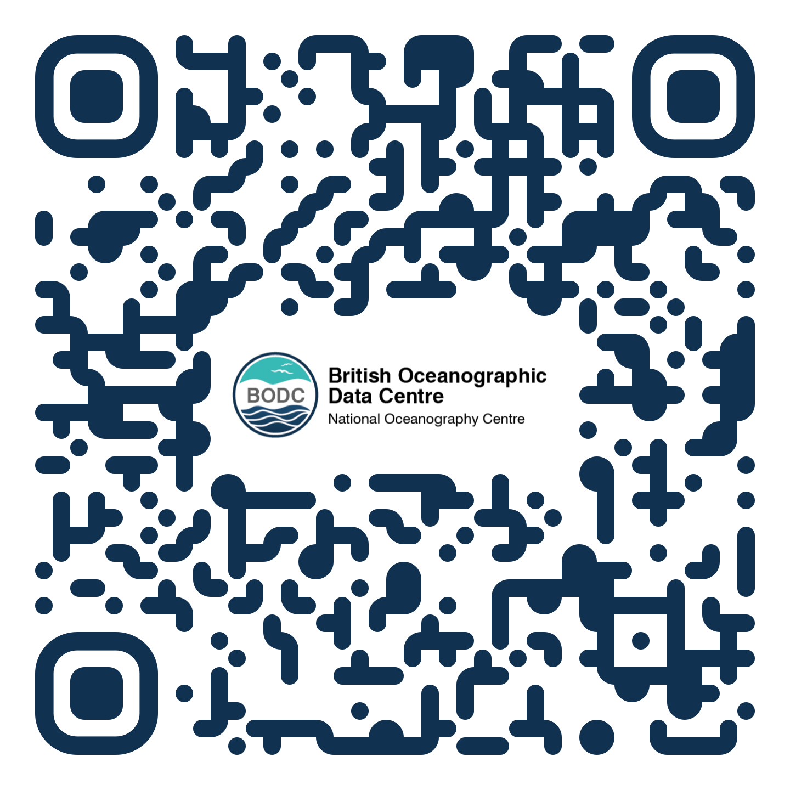

  
  .. code-block:: JSON
  
    [{
       "RelatedIdentifier":{
          "RelatedIdentifierValue":"10.4232/10.CPoS-2013-02en",
          "RelatedIdentifierType": "DOI",
          "relationType":"IsIdenticalTo"
       }]

+-------------------------------------------------------+---------------------------------------------------------------------------------------------+
| Type                                                  | Data                                                                                        |
+=======================================================+=============================================================================================+
| URL                                                   | .. code-block:: JSON                                                                        |
|                                                       |                                                                                             |
|                                                       |     https://linkedsystems.uk/system/instance/TOOL0022_2490/current/                         |
+-------------------------------------------------------+---------------------------------------------------------------------------------------------+
| 21.T11148/8eb858ee0b12e8e463a5 (Identifier)           | .. code-block:: JSON                                                                        |
|                                                       |                                                                                             |
|                                                       |     {                                                                                       |
|                                                       |       "identifierValue":"http://hdl.handle.net/21.T11998/0000-001A-3905-F",                 |
|                                                       |       "identiferType":"MeasuringInstrument"                                                 |
|                                                       |     }                                                                                       |
+-------------------------------------------------------+---------------------------------------------------------------------------------------------+
| 21.T11148/9a15a4735d4bda329d80 (LandingPage)          | .. code-block:: JSON                                                                        |
|                                                       |                                                                                             |
|                                                       |     https://linkedsystems.uk/system/instance/TOOL0022_2490/current/                         |
+-------------------------------------------------------+---------------------------------------------------------------------------------------------+
| 21.T11148/709a23220f2c3d64d1e1 (Name)                 | .. code-block:: JSON                                                                        |
|                                                       |                                                                                             |
|                                                       |     Sea-Bird SBE 37-IM MicroCAT C-T Sensor                                                  |
+-------------------------------------------------------+---------------------------------------------------------------------------------------------+
| 21.T11148/4eaec4bc0f1df68ab2a7 (Owners)               | .. code-block:: JSON                                                                        |
|                                                       |                                                                                             |
|                                                       |     [{                                                                                      |
|                                                       |       "Owner": {                                                                            |
|                                                       |         "ownerName":"National Oceanography Centre",                                         |
|                                                       |         "ownerContact":"louise.darroch@bodc.ac.uk",                                         |
|                                                       |         "ownerIdentifier":{                                                                 |
|                                                       |           "ownerIdentifierValue":                                                           |
|                                                       |             "http://vocab.nerc.ac.uk/collection/B75/current/ORG00009/",                     |
|                                                       |           "ownerIdentifierType":"URL"                                                       |
|                                                       |          }                                                                                  |
|                                                       |        }                                                                                    |
|                                                       |     }]                                                                                      |
+-------------------------------------------------------+---------------------------------------------------------------------------------------------+
| 21.T11148/1f3e82ddf0697a497432 (Manufacturers)        | .. code-block:: JSON                                                                        |
|                                                       |                                                                                             |
|                                                       |     [{                                                                                      |
|                                                       |       "Manufacturer":{                                                                      |
|                                                       |         "manufacturerName":"Sea-Bird Scientific",                                           |
|                                                       |         "modelName":"SBE 37-IM",                                                            |
|                                                       |         "manufacturerIdentifier":{                                                          |
|                                                       |           "manufacturerIdentifierValue":                                                    |
|                                                       |             "http://vocab.nerc.ac.uk/collection/L35/current/MAN0013/",                      |
|                                                       |           "manufacturerIdentifierType":"URL"                                                |
|                                                       |         }                                                                                   |
|                                                       |       }                                                                                     |
|                                                       |     }]                                                                                      |
+-------------------------------------------------------+---------------------------------------------------------------------------------------------+
| 21.T11148/55f8ebc805e65b5b71dd (Description)          | .. code-block:: JSON                                                                        |
|                                                       |                                                                                             |
|                                                       |     A high accuracy conductivity and temperature recorder with an optional pressure sensor  |
|                                                       |     designed for deployment on moorings. The IM model has an inductive modem for real-time  |
|                                                       |     data transmission plus internal flash memory data storage.                              |
+-------------------------------------------------------+---------------------------------------------------------------------------------------------+
| 21.T11148/f76ad9d0324302fc47dd (InstrumentType)       | .. code-block:: JSON                                                                        |
|                                                       |                                                                                             |
|                                                       |     http://vocab.nerc.ac.uk/collection/L22/current/TOOL0022/                                |
+-------------------------------------------------------+---------------------------------------------------------------------------------------------+
| 21.T11148/72928b84e060d491ee41 (MeasuredVariables)    | .. code-block:: JSON                                                                        |
|                                                       |                                                                                             |
|                                                       |     [{                                                                                      |
|                                                       |       "MeasuredVariable":{                                                                  |
|                                                       |         "VariableMeasured":                                                                 |
|                                                       |           "http://vocab.nerc.ac.uk/collection/P01/current/CNDCPR01/"                        |
|                                                       |       }                                                                                     |
|                                                       |     },{                                                                                     |
|                                                       |       "MeasuredVariable":{                                                                  |
|                                                       |         "VariableMeasured":                                                                 |
|                                                       |           "http://vocab.nerc.ac.uk/collection/P01/current/PSALPR01/"                        |
|                                                       |       }                                                                                     |
|                                                       |     },{                                                                                     |
|                                                       |       "MeasuredVariable":{                                                                  |
|                                                       |         "VariableMeasured":                                                                 |
|                                                       |           "http://vocab.nerc.ac.uk/collection/P01/current/TEMPPR01/"                        |
|                                                       |       }                                                                                     |
|                                                       |     },{                                                                                     |
|                                                       |       "MeasuredVariable":{                                                                  |
|                                                       |         "VariableMeasured":                                                                 |
|                                                       |           "http://vocab.nerc.ac.uk/collection/P01/current/PREXMCAT/"                        |
|                                                       |       }                                                                                     |
|                                                       |     }]                                                                                      |
+-------------------------------------------------------+---------------------------------------------------------------------------------------------+
| 21.T11148/22c62082a4d2d9ae2602 (Dates)                | .. code-block:: JSON                                                                        |
|                                                       |                                                                                             |
|                                                       |     [{                                                                                      |
|                                                       |       "date":{                                                                              |
|                                                       |         "date":"1999-11-01",                                                                |
|                                                       |         "dateType":"Commissioned"                                                           |
|                                                       |       }                                                                                     |
|                                                       |     }]                                                                                      |
+-------------------------------------------------------+---------------------------------------------------------------------------------------------+
| 21.T11148/eb3c713572f681e6c4c3 (AlternateIdentifiers) | .. code-block:: JSON                                                                        |
|                                                       |                                                                                             |
|                                                       |     [{                                                                                      |
|                                                       |       "AlternateIdentifier":{                                                               |
|                                                       |         "AlternateIdentifierValue":"2490",                                                  |
|                                                       |         "alternateIdentifierType":"serialNumber"                                            |
|                                                       |       }                                                                                     |
|                                                       |     }]                                                                                      |
+-------------------------------------------------------+---------------------------------------------------------------------------------------------+
| 21.T11148/178fb558abc755ca7046 (RelatedIdentifiers)   | .. code-block:: JSON                                                                        |
|                                                       |                                                                                             |
|                                                       |     [{                                                                                      |
|                                                       |       "RelatedIdentifier":{                                                                 |
|                                                       |         "RelatedIdentifierValue":                                                           |
|                                                       |           "https://www.bodc.ac.uk/data/documents/nodb/pdf/37imbrochurejul08.pdf",           |
|                                                       |         "RelatedIdentifierType": "URL",                                                     |
|                                                       |         "relationType":"IsDescribedBy "                                                     |
|                                                       |       }                                                                                     |
|                                                       |     }]                                                                                      |
+-------------------------------------------------------+---------------------------------------------------------------------------------------------+

    
    
    
+------------------------------------+-------------------------------------------------------------------------------------------------+
|      |                                                                                                 |
+======+=================================================================================================+
| test | .. code-block:: JSON                                                                            |
|      |                                                                                                 |
|      |     [                                                                                           |
|      |       {                                                                                         |
|      |         "Owner": {                                                                              |
|      |           "ownerName": "National Oceanography Centre",                                          |
|      |           "ownerContact": "louise.darroch@bodc.ac.uk",                                          |
|      |           "ownerIdentifier": {                                                                  |
|      |             "ownerIdentifierValue": "http://vocab.nerc.ac.uk/collection/B75/current/ORG00009/", |
|      |             "ownerIdentifierType": "URL"                                                        |
|      |           }                                                                                     |
|      |         }                                                                                       |
|      |       }                                                                                         |
|      |     ]                                                                                           |
+------+-------------------------------------------------------------------------------------------------+
|      |                                                                                                 |
+------+-------------------------------------------------------------------------------------------------+

URL
21.T11148/8eb858ee0b12e8e463a5 (Identifier)
21.T11148/9a15a4735d4bda329d80 (LandingPage)
21.T11148/709a23220f2c3d64d1e1 (Name)
21.T11148/4eaec4bc0f1df68ab2a7 (Owners)
21.T11148/1f3e82ddf0697a497432 (Manufacturers)
21.T11148/55f8ebc805e65b5b71dd (Description)
21.T11148/f76ad9d0324302fc47dd (InstrumentType)
21.T11148/72928b84e060d491ee41 (MeasuredVariables)
21.T11148/22c62082a4d2d9ae2602 (Dates)
21.T11148/eb3c713572f681e6c4c3 (AlternateIdentifiers)
21.T11148/178fb558abc755ca7046 (RelatedIdentifiers)

